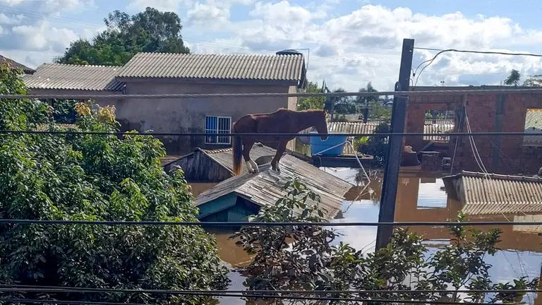
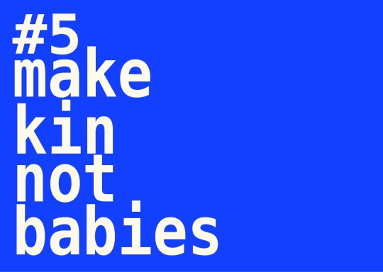

<!--

author: Moritz Riemann, Niklas Schulte
email:  riemann@philsem.uni-kiel.de, schulte@soziologie.uni-kiel.de
version: 0.1
language: en
narrator: UK English Female

\-->

# Natur und Kultur zwischen Soziologie und Philosophie

**Dozierende**

* Moritz Riemann (riemann@philsem.uni-kiel.de)
* Niklas Schulte (schulte@soziologie.uni-kiel.de)
* Gemeinsame Sprechstunde zwecks Vorbesprechung der Referate immer Mittwochs im Anschluss an das Seminar: 16 Uhr, Boschstraße 1, R.01.001

**Zeit und Raum**

Sommersemester 2024 | Mittwochs, 14:15 – 15:45 | Raum: LS1, R. 106a

**Inhalt**

Interdisziplinäre Lehrveranstaltung Philosophie und Soziologie

Die häufig ambivalenten Beziehungen zwischen Natur und Gesellschaft werden im Seminar anhand zeitgenössischer Texte aus dem sogenannten ‚Neuen Materialismus‘ und der strukturalen Anthropologie beleuchtet, in denen tradierte Vorstellungen von Mensch, Tier und Materialität oft grundlegend hinterfragt werden. In kritischer Auseinandersetzung mit prominenten Denker*innen wie Donna Haraway, Bruno Latour, Philippe Descola, u.a. soll dabei Raum sein, Perspektiven für eine Reinterpretation des Mensch-Natur-Verhältnisses zu diskutieren und zu Debatten um Naturbeherrschung und Anthropozän in Beziehung zu setzen.

Das Seminar richtet sich dabei an Studierende der Soziologie und der Philosophie gleichermaßen und ist Teil eines universitätsübergreifenden Lehrprojektes zu Fragestellungen des neuen Materialismus, in dessen theoretischen Horizont sich der Strukturalismus von Natur und Kultur einordnen lässt. Mit Partnerseminaren an den Universitäten Wuppertal und Prag wird über das Sommersemester ein Workshop vorbereitet, der im Oktober an der Karls-Universität Prag stattfindet – und optional ebenfalls besucht werden kann.

## Module und Hinweise

**Philosophie-Module**

* BA 6 (Praktische Philosophie II - Vertiefung)
* BA7/BA8 (Kulturphilosophie, Naturphilosophie)
* BA9 (Problemstellungen und Theorien der Gegenwartsphilosophie)
* BA10 (Forschungsorientiertes Abschlussmodul)
* PHF-phil-WP (Philosophische Reflexion und ethische Urteilskraft)

**Soziologie-Modul**

* 'Spezielle Soziologien' (soz-SM1-1; soz-SM2-1) (Einführung)

**allgemeine Hinweise**

* Grundlage für ein erfolgreiches Seminar ist das intensive Lesen der bereitgestellten Texte und die Bereitschaft zur Diskussion der jeweiligen Positionen. Versuchen Sie, die Texte einzuordnen und in einen Kontext von für Sie relevanten Fragestellungen zu setzen. Fertigen Sie hierzu eigene Mitschriften an und überlegen Sie sich vor jeder Sitzung einige Fragen, die sich beim Lesen der Texte ergeben. Recherchieren Sie im Vorfeld Begriffe, die Ihnen womöglich unklar oder ungenau erscheinen und bringen sie etwaige Unklarheiten in die Diskussion ein.
* Referate: Gehen Sie davon aus, dass alle Teilnehmenden die Texte gelesen haben. Vermeiden Sie also eine bloße Inhaltsangabe. Versuchen Sie, den Argumentationszusammenhang herauszustellen und in den Kontext des Seminars einzubetten. Klären Sie Begriffe und stellen Sie gern auch einzelne Textpassagen ausführlicher dar, die Sie für besonders bezeichnend erachten. Im Umfang sollten 30 Minuten nicht überschritten werden.  Die Erstellung eines Handouts und/oder einer Präsentation ist obligatorisch.

Referate werden bevorzugt im interdisziplinären Tandem gehalten: Ein:e Soziolog:in und ein:e Philosoph:in.

## Prüfungsleistungen

**Philosophie – Module & Prüfungsleistungen**

* BA 6 (Praktische Philosophie II - Vertiefung): Hausarbeit im Umfang von 10 Seiten
* BA7/BA8 (Kulturphilosophie, Naturphilosophie): Referat, Essay, Hausarbeit, Mündliche Prüfung
* BA9 (Problemstellungen und Theorien der Gegenwartsphilosophie): Hausarbeit oder Essay
* BA10 (Forschungsorientiertes Abschlussmodul): Referat
* PHF-phil-WP (Philosophische Reflexion und ethische Urteilskraft): Essay (5-7 Seiten)
* Beachten Sie die Handreichung zum wissenschaftlichen Arbeiten im Fach Philosophie. Jedes Referat, jede Hausarbeit und jeder Essay sind im Vorfeld in der Sprechstunde abzustimmen. Der Abgabetermin für die schriftlichen Prüfungsleistungen ist der 15.10.2024. Die Abgabe erfolgt als Ausdruck, mit Deckblatt und unterschriebener Eigenständigkeitserklärung an der Hauptpforte oder im Briefkasten für Prüfungsleistungen in der LS4. Keine Abgabe per Email!
* In den beiden Wahlpflichtmodulen BA7 und BA8 sind aus den drei Gegenstandsbereichen Naturphilosophie, Kulturphilosophie und Wissenschaftsphilosophie zwei verschiedene Gegenstandsbereiche zu wählen. Bitte beachten Sie also: Der im Modul BA7 gewählte Gegenstandsbereich muss ein anderer sein als der im Modul BA8 gewählte Gegenstandsbereich!

**Soziologie - Module & Prüfungsleistungen**

Da es sich bei den Modulen soz-SM1-1 und soz-SM2-1 um auf zwei Semester angelegte Seminare handelt, empfiehlt es sich, die Hausarbeit (große Leistung, 4LP) im Wintersemester zu erbringen.

Überlegen Sie sich für die Einführungsveranstaltung im Sommersemester ob Sie ein Referat halten oder ein Sitzungsprotokoll übernehmen und (in der darauf folgenden Sitzung)  vorstellen möchten (2LP).

## Semesterplan

| Datum | Thema, Inhalt | Referat | Protokoll |
|-------|---------------|---------|-----------|
| 17.04.2024 | Organisatorisches & Einführung: Vinciane Despret: Wie der Vogel wohnt (2022) | kein Referat | kein Protokoll |
| 24.04.2024 | Naturbegriff und Moderne - Bruno Latour: Kampf um Gaia (2017) | kein Referat | Protokoll: N.N. |
| 01.05.2024 | Keine Sitzung: Feiertag | kein Referat | kein Protokoll |
| 08.05.2024 | Geschichte(n) des Materialismus - Onlinesitzung mit Impuls-Vortrag und Kennenlernen der Prager Summerschool ‚Akutes Denken‘ | kein Referat | N.N. |
| 15.05.2024 | Klimakrise und Naturbegriff Bruno Latour & Nikolaj Schultz: Zur Entstehung einer ökologischen Klasse (2022) | Lida Shekhzadeh, Lasse Burmeister | Cara Spitzer |
| 22.05.2024 | Ökologie und Praxis Anna L. Tsing: Der Pilz am anderen Ende der Welt (2019) | Enya Docter, Tim Kuhlmann | Lena Langmaack |
| 29.05.2024 | Natur, Technik & Feministische Wissenschaftskritik Donna J. Haraway: Unruhig Bleiben (2016 / 2018) | Adam Kosumov, Julie Hesse| Anna Block |
| 05.06.2024 | Natur, Technik & Feministische Wissenschaftskritik II Donna J. Haraway: Monströse Versprechen. Gender- und Technologie-Essays (1995 / 2017) | Luisa Kulawik, Anna Steinfatt | Amal Ramia |
| 12.06.2024 | (Nicht-Westliche) Naturverhältnisse aus Sicht der Anthropologie - Philippe Descola: Jenseits von Natur und Kultur (2005) | Lee Bölter, Paul Stein | Silas Henke |
| 19.06.2024 | (Nicht-Westliche) Naturverhältnisse aus Sicht der Anthropologie II - Philippe Descola: Von Ganzheiten zu Kollektiven: Wege zu einer Ontologie sozialer Formen (2014) | Anna Nissen, Sophie Kühndahl | Erik Götsche |
| 26.06.2024 | Die Natur und „das Wilde“ I - Eduardo Viveiros de Castro: Der Marmor und die Myrte (2016) | Jakob Wuhnsen, Jana Leifeling | Aaron Schneider |
| 03.07.2024 | Die Natur und „das Wilde“ II - Eduardo Viveiros de Castro: Der Marmor und die Myrte (2016) | Miedia Sibari, Marcel Krüger | Silvo Kuhn |
| 10.07.2024 | Abschlussdiskussion | kein Referat  | kein Protokoll |

## Literatur

**Literaturverzeichnis der Seminarlektüre**

* Viveiros De Castro, Eduardo (2016): Der Marmor und die Myrte. In: Die Unbeständigkeit der wilden Seele. Wien/Berlin: Turia+Kant, 161-231
* Descola, Philippe (2013/2021): Jenseits von Natur und Kultur. 3. Aufl. Frankfurt a.M.: Suhrkamp 
* Descola, Philippe (2014): Von Ganzheiten zu Kollektiven: Wege zu einer Ontologie sozialer Formen. In: ZMK Zeitschrift für Medien- und Kulturforschung. Synchronisation, Jg. 5, Nr. 2, 183– 207.
* Despret, Vinciane (2022): Wie der Vogel wohnt. Berlin: Matthes & Seitz.
* Haraway, Donna J. (1995/2017): Andersweltliche Konversationen; irdische Themen, lokale Begriffe. In: Ebd. Monströse Versprechen. Die Gender- und Technologie-Essays. Hamburg: Argument, 147-183
* Haraway, Donna J. (2018): Unruhig bleiben. Die Verwandtschaft der Arten im Chthuluzän. Frankfurt/ New York: Campus
* Latour, Bruno (2017). Kampf um Gaia. Acht Vorträge über das neue Klimaregime. Berlin: Suhrkamp
* Latour, Bruno/Schultz, Nikolaj (2022): Zur Entstehung einer ökologischen Klasse: ein Memorandum. 2. Aufl. Frankfurt a.M.: Suhrkamp
* Tsing, Anna L. (2020): Der Pilz am Ende der Welt: über das Leben in den Ruinen des Kapitalismus. 5. Aufl. Berlin: Matthes & Seitz

**Literaturhinweise & Sekundärliteratur**

* Bartz, Brigitte (2019): Longing for agency: New materialisms’ wrestling with despair. In: European Journal of Women's Studies. Vol. 26, Issue 2, 181-194
* Hoppe, Katharina / Lemke, Thomas (2021): Neue Materialismen. Zur Einführung. Hamburg: Junius
* Hoppe, Katharina (2017): Beings from the Mud. Donna Haraways Arbeiten zu einer relationalen Ontologie. Online abrufbar unter: https://soziopolis.de/beobachten/kultur/artikel/beings-from-the-mud/
* Kauppert, Michael (2011): Philippe Descolas Anthropologie der Natur. In: Jahrbuch für europäische Ethnologie. Dritte Folge/6, 49-68
* Schürkmann, Christiane (2024): Ökologien des Materiellen. Neomaterialistische und posthumanistische Zugänge. In: Handbuch Umweltsoziologie. 2. Aufl. Wiesbaden: Springer 
* Schmitz, Sigrid (2016): Cyborgs, situiertes Wissen und das Chthulucene. In: Soziopolis-Gesellschaft beobachten. Online abrufbar unter: https://www.soziopolis.de/erinnern/klassiker/artikel/cyborgs-situiertes-wissen-und-das-chthulucene/
* Folkers, Andreas (2013): Was ist neu am ‚Neuen Materialismus‘? In: Goll et al. (Hg.): Critical Matter. Diskussionen eines neuen Materialismus. Edition Assamblage, Münster, 16–33
* Descola, Philippe et al (1996): Nature and Society. Anthropological perspectives. Routledge: London
* Haraway, Donna (1995): ‚Wir sind immer mittendrin‘. Ein Interview mit Donna Haraway. In: Hammer/Stieß (Hrsg.): Die Neuerfindung der Natur. Primaten, Cyborgs und Frauen. Campus Verlag
* Levi-Strauss, Claude (1975): Rosseau. Begründer der Wissenschaften vom Menschen. In: (ebd.) Strukturale Anthropologie. Frankfurt a.M.: Suhrkamp, 45-56
* Precht, Oliver (2021): Weltverlust und Selbstbehauptung. Politische Ökologie und politische Philosophie bei Bruno Latour. In: Bertrams/Roselli (Hg.): Selbstverlust und Welterfahrung. Erkundungen eienr pathischen Moderne. Wien 2021. S. 69-89.

## Hinweise für das Verfassen von Sitzungsprotokollen

### I. Grundformen und Funktionen

1. Wortprotokoll, Verbalprotokoll – direkte Dokumentation des mündlichen Wortlauts z.B. bei Gerichtsverhandlungen
2. Verlaufsprotokoll, Verhandlungsprotokoll – Protokoll des Gesprächsprozesses. Wie kam es zu Beschlüssen oder Ergebnissen? Wie lauteten die Argumente?
3. Ergebnisprotokoll, Beschlussprotokoll – Fokus auf Ergebnisse. Keine Dokumentation des Gesprächsprozesses.
4. Das wissenschaftliche Protokoll – Anteile des Verlauf- und Ergebnisprotokolls. Schriftliche und systematische Wiedergabe diskursiv erarbeiteten Wissens, die eine gemeinsame Wissensbasis schafft. Funktionen: Dokumentation und Aufbereitung des Wissens, Literaturgrundlage, Kontrolle des Wissensstandes, Üben wissenschaftlichen Formulierens

### II. (Sprachliche) Gestaltung

1. Der Protokollkopf: Name der Hochschule, Institut, Seminartyp, Seminarleitung, Protokollant:in, Semester, Datum.

2. Der Protokolltext: 

    * Der Text ist im Präsens und Indikativ zu verfassen. Bei Bezügen auf den Seminarverlauf - also was eine Person sagte - wird Präteritum gewählt. 
    * Das Protokoll ist in ganzen Sätzen (nicht in Stichpunkten) zu formulieren. 
    * Ergebnisse sollen dargestellt werden, allerdings auch deren diskursiver Zusammenhang berücksichtigt werden. Die namentliche Nennung von Sprecher*innen ist nicht angebracht. 
    * Besonders wichtige Aspekte können markiert oder hervorgehoben werden. Auch sollte das Protokoll sinnvoll durch Überschriften und Zwischenüberschriften (Thema und Unterthemen der Sitzung) strukturiert werden. 
    * Übliche Länge sind zwei bis drei DIN-A 4-Seiten.

3. Der Anhang: Bibliographie der Literatur der Seminarsitzung / Folien auf die Bezug genommen wurde.

4. Textformat: Serifenfont (z.B. Times New Roman) 12pt, Fußnoten 10pt., Zeilenabstand 1,5, Blocksatz, Seitenränder 3cm links, 3cm rechts

### III. Herausforderungen

* Balance zwischen diskursivem Verlauf und Ergebnissen -> Herausarbeitung der (zentralen) Ergebnisse.
* Balance zwischen sprachlicher Verknappung/Abstraktion und Wiedergabe der Beiträge. Bitte keine Umgangssprache verwenden. Auf korrekte Fachlexik achten.
* Das Protokoll vor der Abgabe Korrektur lesen (lassen).
* Formal: Protokollkopf einfügen, Gliedern und Strukturieren, Literaturangaben nicht vergessen, Markierungen einheitlich verwenden. (siehe Checkliste)

### IV. Fünf Schritte bei der Erstellung des Protokolls

1. Vorbereitung. Die zu protokollierende Sitzung sollte gut vorbereitet sein.

2. Rezeption der Seminarsitzung. Die anspruchsvolle Aufgabe, Inhalte zu komprimieren und zu strukturieren ist durch eine Tonaufnahme nicht bewältigt, sondern nur vertagt. Außerdem erfordert die Aufnahme das Einverständis des gesamten Plenums. Hören Sie gut zu und seien Sie gnädig mit sich, wenn Sie nicht die vollen 90 Minuten jeden Satz verstehen.

3. Mitschrift während der Sitzung. Wichtige Inhalte müssen dokumentiert werden – gern auch in Stichpunkten oder unter Verwendung von Symbolen und Verweisen. Es ist nicht leicht zu entscheiden, was wichtig und was weniger wichtig ist. Hier hilft es Ihnen, wenn Sie exzellent auf die Seminarsitzung vorbereitet sind. Achten Sie auf folgende Aspekte:

    * Quantität der Besprechungsdauer – Wie lange wurde ein Aspekt besprochen?
    * Top-down denken. Lässt sich die Sitzung in Themenclustern beschreiben? Wie lässt sich eine Struktur herstellen?
    * Gesamtdiskurs aufzeigen. Welche Aspekte vergangener Sitzungen wurden aufgegriffen?
    * Bilanz ziehen. Offene Fragen nennen.

4. Komprimieren und Reproduzieren. Es bietet sich an, die Mitschrift so schnell wie möglich zu bearbeiten, da die Inhalte dann noch frisch erinnert werden. Ergänzen Sie nun aus dem Gedächtnis oder aus Ihren Materialien wichtige Aspekte ihrer Mitschrift und bringen Sie die Inhalte in eine Struktur (die von der Chronologie des Seminars abweichen kann).

5. Erstellen des Protokolls. Die Stichpunkte und Notizen müssen nun in ganze Sätze und eine kohärente Form gebracht werden. Möglicherweise wird der Text auch nochmals umstrukturiert. Der fertige, korrigierte Text kann auch nochmal anhand der Funktionen des Protokolls überprüft werden. Kann eine fremde Person den Sitzungsverlauf und -inhalte nachvollziehen?

Quelle: Kirsten Schindler: Klausur, Protokoll, Essay. Kleine Texte optimal verfassen, Paderborn 2011.

### V. Checkliste vor der Abgabe

 1. Hat Ihr Protokoll einen Kopf?
 2. Ist Ihr Text einheitlich formatiert, im Blocksatz und unter Berücksichtigung der Seitenränder? Stimmen die Seitenumbrüche? Haben Sie Seitenzahlen angegeben?
 3. Haben Sie die Textgrundlage der Sitzung und weitere Quellen einheitlich und eindeutig bibliographisch nachgewiesen?
 4. Besteht Ihr Text aus ganzen und klar verständlichen Sätzen?
 5. Haben Sie Orthographie und Grammatik korrekturgelesen? Haben Sie Fremdwörter und Fachbegriffe nachgeschlagen und deren korrekte Schreibweise überprüft?
 6. Haben Sie die Sitzungsinhalte gegliedert?
 7. Ist Ihr Text ergebnisorientiert verfasst?
 8. Lassen sich die wichtigsten Inhalte der Sitzung anhand Ihres Textes nachvollziehen? Stellen Sie sich vor, Sie müssten einer Kommiliton:in berichten, die bei der Sitzung fehlte.
 9. Bei digitaler Abgabe: Haben Sie Ihr Dokument als .pdf exportiert?
10. Haben Sie alle Punkte der Checkliste berücksichtigt?
11. Haben Sie Ihr Protokoll auf OLAT in den Abgabeordner geladen?

### VI. Vorstellung des Protokolls in der nächsten Sitzung

* Bereiten Sie Ihr Protokoll so vor, dass Sie zu Beginn der darauffolgenden Sitzung in 5 Minuten die Inhalte der protokollierten Sitzung für die Seminarteilnehmenden zusammenfassen können.

## Der Essay als Prüfungsart in den Bachelor- und Masterstudiengängen Philosophie

### 1. Der philosophische Essay

Mit dem Essay als Prüfungsform stellt sich das Philosophische Seminar der Kieler Universität in eine philosophische Tradition, die in dieser literarischen Form die eigenständige Auseinandersetzung mit
einer Frage und These wagt und einen eigenen Gedanken entfaltet. Der Essay (von frz. *essai*: „Versuch“ >
lat. *exagium*, dt. „wägen“, „Gewicht“) ist ein prägnanter Aufsatz über ein philosophisches Problem, eine
kontrovers diskutierte Fragestellung oder These. Im Unterschied zu einer Hausarbeit, in der eine
sachorientierte und systematische Behandlung eines Themas erwartet wird, kommt es beim Essayschreiben
darauf an, das jeweilige Thema in einem größeren Zusammenhang zu ‚erwägen‘, d.h. zu erörtern, um zu einer eigenen Position zu finden und deutlich Stellung zu beziehen. Der Essay erlaubt stilistisch eine größere Freiheit als die wissenschaftliche Hausarbeit, jedoch handelt es sich nicht um eine persönliche Meinungsäußerung, sondern um eine argumentativ begründete Auseinandersetzung.

Die Tradition des philosophischen Essays geht auf die *Essais* von Michel de Montaigne (1533-1592) zurück und betont die eigene Denkbewegung und das erforschende Suchen eines Standpunktes. Mit der essayistischen Form ist eine besondere Form des Philosophierens verbunden, deren Fokus weniger auf der systematischen Auseinandersetzung liegt, sondern vielmehr in der Darstellung der Denkbewegung und Entfaltung eines Gedankens selbst. Mit Francis Bacon (1561-1626), der das Wort von Montaigne übernommen und ins Englische übertragen hat, wird *Essay* zur Gattungsbezeichnung nicht nur philosophischer, sondern auch literarischer Schriften. Beide Autoren gelten als ´Ahnväter´ der philosophischen Essayistik.

Die semantische Erkundung von *essai/essaier* gibt erste Hinweise auf die Unmittelbarkeit und Erfahrungsorientiertheit der essayistischen Denk- und Schreibweise: Wer essayistisch denkt und schreibt, fängt bei sich, d.h. den eigenen Erfahrungen mit der Welt und mit sich selbst an; sie/er unterzieht dabei die eigenen Sichtweisen, Erfahrungen, Urteile, aber auch das, was an Sichtweisen, Erfahrungen, Urteilen anderer jeweils begegnet, einer denkenden Prüfung oder Erwägung. Wenn es sich bei dem Geschriebenen noch dazu um Versuche handelt, so sind die damit verbundenen Wissens-, Erkenntnis- oder Wahrheitsansprüche anscheinend deutlich herabgestimmt. Zugleich bedeutet die essayistische Denkweise aber auch die Erprobung einer Perspektive auf eine bestimmte Sache (seien es Dinge, Sachverhalte/Phänomene, Situationen, Ereignisse), um sie zu erschließen und zu beurteilen.

Eine Hochzeit der philosophischen Essayistik lag in der europäischen Aufklärung des 18. Jahrhunderts. Die Zeit der kritischen Emanzipation von tradierten Herrschaftsverhältnissen hat namhaften Essayisten wie Voltaire in Frankreich, David Hume in England und Gotthold Ephraim Lessing in Deutschland hervorgebracht.

 
Das Essayschreiben erfordert in besonderer Weise kritisches Selbstdenken und die Entwicklung einer eigenständigen Argumentation. Auch wenn die Rückbeziehung auf persönliche bzw. alltägliche Erfahrungen dabei ein wesentlicher Bestandteil der Essayistik ist, **so liegt im Philosophiestudium der Akzent beim Essayschreiben doch deutlich auf der gedanklichen Auseinandersetzung mit einer philosophischen Problemstellung/Kontroverse oder einer philosophischen Position oder einem philosophischen Begriff.** In diesem Kontext kommt es darauf an, sich philosophische Texte methodisch erschließen zu können, um sie angemessen zu verstehen und auszulegen. Mit Hans Georg Gadamer lässt sich der Vorgang des Verstehens als ein Bemühen beschreiben, mit dem Text ´ins Gespräch zu kommen´, d.h. den historischen Horizont des Textes mit dem eigenen „Verstehenshorizont der Gegenwart“, seinen impliziten Maßstäben und legitimen Vorurteilen zu „verschmelzen“.[^1] Eine gute Vorbereitung für diese **hermeneutische Herangehensweise beim Essayschreiben** ist es, sich vor der Lektüre die eigenen Erwartungen an den Text bzw. an das Thema und das eigene Vorverständnis zu vergegenwärtigen.[^2] Wie bei einem Gespräch mit einem unbekannten Menschen, kann dies dazu beitragen, das Gefühl der Fremdheit zu überwinden und dem Gelesenen gegenüber aufgeschlossen zu bleiben – also: aufmerksam ´zuzuhören´. 

[^1]: H.-G. Gadamer: *Wahrheit und Methode. Grundzüge einer philosophischen Hermeneutik.* Tübingen 1960. 6. Aufl. 1990. S.289f. 

[^2]: Vgl. Thomas Rentsch/Johannes Rohbeck: *Essays schreiben – aber mit Methode.* In: Jahrbuch für Didaktik der Philosophie und Ethik 8 (2007). S. 75-81. hier S.78f.

**Literaturhinweise**

Montaigne, Michel de: *Essais*. Übers. v. Hans Stilett. Frankfurt a.M. 2001.

Bacon, Francis: *Essays oder praktische und moralische Ratschläge*. Übers. v.  Elisabeth Schücking. Hrsg. v. Levin Schücking. Stuttgart 2011.

Konersmann, Ralf: *Essay*. in: Ders.: Wörterbuch der Unruhe. Frankfurt a. M. 2017. S.49-55.

Černy, Lothar: *Essay*, in: Historisches Wörterbuch der Philosophie. Hrsg. v. Joachim Ritter, Karlfried Gründer und Gottfried Gabriel. Basel 1971-2007. Bd. 2, Sp.746-749.

Schärf, Christian: *Geschichte des Essays. Von Montaigne bis Adorno.* Göttingen 1999.

### 2. Der Essay als Prüfungsart in den Bachelor- und Masterstudiengängen Philosophie

Der Essay kann in den BA-Wahlpflichtmodulen BA7 und BA8 als eine unter vier Prüfungsarten gewählt werden (Umfang: ca. 10 Seiten); im Modul BA9 ist er neben einer Hausarbeit als weitere Prüfungsart vorgeschrieben. – In den Masterstudiengängen Philosophie ist der Essay verpflichtende Prüfungsart in den Modulen MAA1 bzw. MAE2. 
Die Form des Essays als Prüfungsleistung ist offener als bei einer Hausarbeit. Zur Form gehören die Zitation und eine Bibliographie, wie es auch die wissenschaftliche Hausarbeit fordert. Jedoch sind strenge Strukturierungen mit einem Inhaltsverzeichnis und einer Kapitelstruktur nicht erforderlich. Selbstverständlich gehört zur Prüfungsleistung des Essays ebenso ein Titelblatt wie die aktuelle Eigenständigkeitserklärung. Die offenere Form liegt in größerer sprachlicher und stilistischer Freiheit. Die eigene Perspektive auf eine philosophische Frage oder einen philosophischen Gedanken darf ausgeführt werden, ohne dabei reine Meinungsäußerung zu sein. Es darf mit Beispielen zur Veranschaulichung und Sprachbildern, Metaphern, Fragen gearbeitet werden. Dabei sollte jedoch eine erkennbare Ordnung der Gedanken, d.h. nachvollziehbare Gedankengänge und die erforderliche logische Konsistenz nicht vernachlässigt werden. Ziel ist es einen Standpunkt zu er- und begründen und eine kritische Reflexion eines philosophischen Gegenstandes vorzunehmen.
Es bestehen verschiedene Möglichkeiten, einen Essay zu verfassen. Jonas Pfister[^3] unterscheidet drei Formen des studentischen Essays: 1) den *kritischen* Essay, der eine kritische Prüfung einer philosophischen These vornimmt; 2) den *problemlösenden* Essay, der die Lösung eines philosophischen Problems versucht, und 3) den *urteilenden* Essay, der die Entscheidung eines philosophischen Streits versucht. Jay F. Rosenberg[^4] erläutert wie in einem Essay eine *begründete Verteidigung einer These* erfolgt.

**Achtung:** Das Thema des Essays ist in der Regel im Rahmen des Seminarhorizonts frei gewählt, aber stets mit den Dozent*innen abzustimmen! Das gleiche gilt für etwaige spezifischen Anforderungen des Essays als Prüfungsleistung, die von der jeweiligen Lehrperson festgelegt werden. Diese können von den hier formulierten Anforderungen abweichen.

**Hinweise zum Essayschreiben** s. Lektion zum Essay im **E-Learning Kurs** *Wissenschaftliches Arbeiten im Fach Philosophie*, 3.6/Lektion 13:

[^3]: Vgl. Pfister, Jonas: *Werkzeuge des Philosophierens*. S.246-250.

[^4]: Vgl. Rosenberg, Jay F.: *Philosophieren. Ein Handbuch für Anfänger*. Frankfurt a. M. 2009. S.81.

## 2. Sitzung 24.04.2024

Textgrundlage: Kampf um Gaia (2017) Erster Vortrag: Über die Instabilität (des Begriffs) der Natur, S. 21-75.

### Bruno Latour (1947-2022)

* Mitbegründer der Akteur-Netzwerk Theorie (ANT)
* Wissenschaftssoziologe 
* Technikphilosoph
* ‚Anthropologe der Moderne‘
* Theoretiker der Post-Sozialität 

**Einflussreiche Schriften**

* Laboratory Life. The Social Construction of Scientific Facts (1979/1986)

* Wir sind nie modern gewesen. Versuch einer symmetrischen Anthropologie (1995)

* Das Parlament der Dinge. Für eine politische Ökologie (2001)

### Problematisierung der Moderne(n Kosmologie)

**Reinigungsarbeit:** 

* Trennung von Natur/Kultur, Objekt/Subjekt, Passiv/Aktiv, usw.

**Übersetzungsarbeit:** 

* Hybridisierung
* Wir finden überall Dinge, Technik, Natur und Wissenschaft vermischt und vermittelt 

_Als Vertreter einer symmetrischen Anthropologie und der Akteur-Netzwerke Theorie (ANT) prägt Latour Forschungsperspektiven und Begriffe_

* NaturKultur
* Aktanten; Akteure 
* Quasi-Objekte (M. Serres) _(als Hybride = real, sozial & diskursiv zugleich)_
* Kollektive; Assoziationen: _‚assoziieren‘ Nicht-Menschen und Menschen miteinander_
* Reinigungsarbeit / Übersetzungsarbeit
* Gaia, das ‚Terrestrische‘ und die ‚Kritische Zone‘ 
* Ökologische Klasse

„Kernstück Latours technikphilosophischer Überlegungen bildet die Kritik der Vorstellung, dass sich die Wirklichkeit in zwei fundamental verschiedene ontologische Sphären, einer Gesellschaft, bestehend aus freien, autonomen Menschen und einer Natur, die sich aus passiven stummen Objekten zusammensetzt, scheiden ließe. 

Demgegenüber geht Latour davon aus, dass diese Unterscheidung erst ein Produkt einer modernen Übereinkunft darstellt. Die moderne Verfassung lässt sich mit Latour als eine verpflichtende Selbstfestlegung, als eine semantische Ordnung (Latour 2008, 22f.) verstehen, in dessen Zentrum die Vorstellung steht, dass sich Natur und Gesellschaft, Geist und Materie, Subjekt und Objekt, Mensch und Tier, Technik und Körper, Artifizielles und Natürliches, Physikalisches und Nichtphysikalisches sowie Beobachtung und Eingriff analytisch trennscharf auseinanderhalten ließen.“ 

(Josef Barla/Steinschaden 2012: 2) 

„Es gibt ebenso wenig Kulturen – unterschiedliche oder universelle –, wie es eine universelle Natur gibt. Es gibt nur Naturen/Kulturen: sie bilden die einzige Grundlage für einen möglichen Vergleich.“ 

(Latour 1995: 139f; Gesing et al. 2019)

"Latour entleiht den Begriff des Aktanten [...] und bezeichnet damit alle Einheiten, die in einem Netzwerk einen Effekt haben. Akteure sind zur Gestalt geronnene Aktanten und sind so als Figuren adressierbar." 

(Stäheli 2021: 95/3)

## 3. Sitzung 08.05.2024

**Onlinesitzung mit Vortrag von Dr. Bastian Ronge (Wuppertal)**

https://uni-kiel.zoom-x.de/j/61037046291?pwd=U3l1emNuTWxxbXpEWHhNZmxOQkI5dz09

## 4. Sitzung 15.05.2024

Textgrundlage: Bruno Latour & Nikolaj Schultz: Zur Entstehung einer ökologischen Klasse (2022)

>„Unter welchen Bedingungen könnte die Ökologie die Politik um sich herum organisieren, statt nur eine Bewegung unter anderen zu sein? Darf sie hoffen, den politischen Horizont so zu definieren, wie es einst der Liberalismus, dann die Sozialismen sowie der Neoliberalismus taten, und wie es seit Kurzem die illiberalen oder neofaschistischen Parteien tun, deren Aufstieg sich ungebremst fortsetzt?“ 
(Latour/Schultz 2022: 9 / 1)

**‚Memorandum‘**

>„Aufzeichnung eines diplomatischen Vertreters, um den Standpunkt einer ‚Regierung‘ darzulegen“ 
(ebd.: 5)

>„Die Ökologie – soviel dürfte verständlich geworden sein – ist nicht das Eindringen der Natur in den öffentlichen Raum, sondern das ‚Ende der ‚Natur‘ als eines Konzepts, das uns erlaubt, unsere Beziehungen zur Welt zu resümieren und zu pazifizieren. […] Das Konzept ‚Natur‘ erscheint jetzt als eine verstümmelte, vereinfachte, übertrieben moralisierende, exzessiv polemische, verfrüht politische Version der Alterität der Welt, der wir uns öffnen müssen, um nicht alle miteinander wahnsinnig zu werden.“ 
(Latour 2017: 68f)

>„Wir sind nicht länger Menschenwesen in der Natur, sondern Lebewesen inmitten anderer Lebewesen in offener Entwicklung mit und gegen uns, die alle an demselben Terraforming teilnehmen“ 
(Latour 2022: 49, (39))

### Informationen zur Bewerbung für Prag

**Autumn School 11.-13.10.2024**

(Anreise 10.10.2024)

**Bewerbung bis 15.06.2024**

* Motivationsschreiben (1 Seite)
* Kurzer akademischer CV (Lebenslauf) unter Angabe von Studienfächern und Interessen
* einzureichen als ein PDF-Dokument per Mail an uns beide

### Protokoll der Sitzung vom 15.05.2024

**Protokollantin: Cara Spitzer (Soziologie)**

**Thema der Sitzung**

Das Thema der Sitzung lautet „Klimakrise und Naturbegriff“. Als Grundlage dient das Memorandum von Bruno Latour und Nikolaj Schultz Zur Entstehung einer ökologischen Klasse.
Die diskursive Erarbeitung der Inhalte begann mit einem Vortrag, in dem zunächst ein kurzer biographischer Hintergrund der Autoren erläutert wurde. Außerdem wurden die zentralen Begriffe des Marx‘schen Klassenkampfes, die auch im Text aufgegriffen werden, erläutert und die wichtigsten Aspekte des Textes zusammengefasst.
Die Diskussion im Plenum wurde mit der Frage eröffnet, wie die ökologische Klasse sinnvoll handeln kann. Im Text wird darauf hingewiesen, dass es eine der zentralen Herausforderungen der ökologischen Klasse ist, diesen Sinn zu stiften, da er sich nicht unbedingt von selbst ergibt, wie es das moderne Fortschrittsnarrativ suggeriert. Dies mache es besonders anspruchsvoll, denn der Sinn der Geschichte könne – laut Latour und Schultz – nun anders definiert werden.

**Aufgabe der ökologischen Klasse**

Anschließend wurde die Diskussionsfrage der Referentin und des Referenten aufgegriffen: Inwieweit kann eine nachhaltige Entwicklung erreicht werden, die ein harmonisches Verhältnis zwischen Mensch und Umwelt fördert, ohne die Produktion als primäres Ziel zu betrachten? Diese sehr weit gefasste Frage trifft den Kern des Memorandums, denn genau dieses Problem soll die entstehende ökologische Klasse lösen. Im Plenum wurden einige zentrale Aspekte hervorgehoben. Zum einen gehe es darum, das Primat der Produktion zu brechen und stattdessen die Bewohnbarkeit der Erde und die Nachhaltigkeit in den Mittelpunkt zu stellen. Dabei geht es vor allem darum, Produktion nicht als Herstellen, sondern als Kombinieren und Zusammenfügen zu verstehen, als Einwickeln statt Entwickeln, wie Latour und Schultz (2022, S.27) schreiben.

Über die im Text genannten Punkte hinaus wurde auch auf Hartmut Rosa und die Kritik am guten Leben verwiesen. Denn auch hier wird die Anhäufung materieller Ressourcen als primäres Ziel problematisiert. Allerdings wurde in diesem Zusammenhang darauf hingewiesen, dass Überkonsum vor allem in den reichen Industrieländern zu beobachten sei und für einen Großteil der Bevölkerung in Entwicklungsländern eher die Befriedigung von Grundbedürfnissen im Vordergrund stehe.

**Verhältnis zwischen Mensch und Natur**

Ein wesentlicher Aspekt, der in der Formulierung der Diskussionsfrage enthalten ist, ist die Frage nach einem harmonischen Verhältnis zwischen Mensch und Umwelt. Denn wie bereits in der Sitzung vom 24.04.2024 diskutiert, beginnt für Latour das Problem an dieser Stelle, nämlich bei der Trennung von Mensch und Umwelt. Die Studierenden brachten ein, dass der Text auch dazu auffordere, die alten Denkmuster des Anthropozentrismus zu überwinden. In den bisherigen Klassenkämpfen sei alles Nichtmenschliche als bloße Ressource betrachtet worden, die ökologische Klasse müsse aber Prosperität in diesem Zusammenhang neu denken.

Es wurde die Frage aufgeworfen, ob die Menschen sich nicht nur um die Umwelt sorgen, weil die Umweltzerstörung ihre eigene Existenz bedroht. Dies wurde von einigen Diskussionsteilnehmern bestätigt. Die Umweltzerstörung sei kein neues Phänomen und es stelle sich die Frage, warum erst jetzt und nicht ausreichend gehandelt werde. Diese Lähmung und die teilweise diffuse Motivation stellen für die ökologische Klasse eine große Herausforderung dar. Diese Frage wird im Text nicht explizit angesprochen. Dennoch muss dem entgegengehalten werden, dass dies wiederum das Primat des Menschen voraussetzt. In der Diskussion wurde darauf hingewiesen, dass Latour und Schultz auch deutlich machen, dass der ökologische Klassenkampf kein rein menschlicher Klassenkampf ist, sondern eher organisch gedacht werden muss, als reproduktive Lebewesen nebeneinander.

**Disharmonisches Naturverständnis**

Dies führte zum letzten Diskussionspunkt: Latours disharmonisches Naturverständnis. Es scheint offensichtlich, dass der Kampf ums Überleben in der Natur verankert ist. Wir Menschen sind Teil dieses Kreislaufs, wir bedrohen und wir werden bedroht. Ob es in diesen vielen einzelnen disharmonischen und harmonischen Beziehungen so etwas wie eine übergeordnete Harmonie der Summe des Systems gibt, bleibt offen.

Die Diskussion konnte mit einem Zitat zusammengefasst werden, das die zentralen Punkte der diskutierten Inhalte umfasst: Wir sind nicht länger Menschenwesen in der Natur, sondern Lebewesen inmitten anderer Lebewesen [Auflösen der Trennung von Mensch und Umwelt] in offener Entwicklung mit und gegen uns [disharmonisches Naturverständnis], die alle an demselben Terraforming teilnehmen [ökologische Klasse ist nicht nur menschlich; alles bewegt sich] (2022, S.49).

## 5. Sitzung 22.05.2024

Textgrundlage: Anna L. Tsing: Der Pilz am anderen Ende der Welt (2019)

### Hartmut Rosa: 

**Ambivalenz von Natur-Kultur-Beziehungen**

>"Festzuhalten bleibt, dass die kulturell etablierte Weltbeziehung der Moderne zwischen einem handlungspraktisch und institutionell dominanten Naturverhältnis, dem Natur als Ressource dient, die es intellektuell zu beherrschen, technisch zu bearbeiten und ökonomisch zu nutzen gilt, und einem psychoemotionalen Naturverhältnis, in dem Natur als primordiale Resonanzsphäre fungiert, gleichsam vermittlungslos hin- und herpendelt." (Rosa 2016: 467)

* Instrumentelles  Verhältnis zur Natur 
* Romantisiertes  Verhältnis zur Natur

**Ambivalenz von Mensch-Tier-Beziehungen**

>"Die ästhetisch-kontemplative Rezeption und die produktivistische Bearbeitung, Berechnung und Vernutzung der Natur bleiben weiterhin unvermittelt und unvereinbar nebeneinander stehen. Nirgendwo wird der daraus resultierende Widerspruch deutlicher als in unserem Umgang mit Tieren." (ebd.: 471f)

>“An der Rettungsaktion waren insgesamt vier Schlauchboote und vier Unterstützungsschiffe mit Feuerwehrleuten, Soldaten und anderen Freiwilligen beteiligt. Das Ganze wurde aus Hubschraubern gefilmt und live im Fernsehen übertragen. […]

>"Caramelo" erholt sich derweil in einer Tierklinik, die einer Universität angegliedert ist. Die dort beschäftigte Veterinärin und Professorin Mariângela Allgayer schrieb in sozialen Medien, das Pferd sei sehr dehydriert gewesen.”

"Ein gerettetes Pferd wird zum Symbol der Hoffnung in Brasilien."

[Quelle](https://www.tagesschau.de/ausland/amerika/brasilien-hochwasser-pferd-100.html)

### Protokoll der Sitzung am 22.05.2024

**Protokollantin: Lena Sophie Langmaack**

**Sitzungsthema**

Das Sitzungsthema lautet diese Woche „Ökologie und Praxis". Die Grundlage bildet dabei der
Text *Der Pilz am anderen Ende der Welt* von Anna Tsing. 

Den Anfang der Sitzung bildete eine Rekapitulation der vorherigen Woche, in welcher es thematisch um die „Klimakrise und Naturbegriff“ ging. Diese stützte sich auf Literatur von Bruno Latour und Nicolaj Schultz. In dem Nachtrag wurde darauf eingegangen, dass die Ambivalenz von Natur-Kultur-Beziehung in der Mensch-Tier-Beziehung stecke und dessen Inbegriff bilde. Beispielhaft wurde dabei das Bild eines geretteten Pferdes vor dem Unwetter in Brasilien angeführt.

Von diesem Punkt aus wurde übergeleitet zum Referat, welches mit der Beleuchtung des biografischen Hintergrundes der Autorin des Textes dieser Woche begann. Fortführend wurde der Aufbau des Buches,welches durch die vielen Unterkapitel heraussticht, mit der Struktur des Matsutake-Pilz verglichen, da diese als genauso verflochten gilt.

**Gegenstand des Textes**

Unsere Welt wird von Tsing als eine prekäre Welt charakterisiert und als solche, die vom Kapitalismus desillusioniert sei. Dem Matsutake-Pilz wird hierbei eine Möglichkeit zur Orientierung zugeschrieben, wie der Kapitalismus überlebt werden kann.

**Diskussion der Gruppe**

Die Diskussion des Kurses wurde mit der Frage eingeleitet, inwieweit die Verflechtungen, wie sie von Tsing beschrieben wurden, hilfreich bei der Erhaltung der Umwelt sei. Zunächst wurde kommentiert, dass es für das Verständnis von Tsing eine Art Identifikation mit der Natur brauche insofern, dass wir Menschen uns erst um die Natur kümmern, wenn wir unmittelbar davon betroffen sind. Hierbei wurde ergänzt, dass der Begriff des polyphonen Gefüges, wie er von Tsing angeführt wird, zu verknüpfen sei mit der Forderung von Latour, welcher für die Auflösung des Gegensatzes von Kultur und Natur, hin zur Betrachtung als wechselseitiges Gefüge plädiert hat.

Von der Referentin wurde nachgetragen, dass die Zerstörung der Umwelt seitens des Menschen anthroprozentrisch gesehen als Triumph gesehen werden könne, der Mensch sich im Endeffekt doch jedoch selbst zerstöre. Hierzu wurde die Verbindung geschlagen, dass das Bild des Pilzes im Text sehr eindrucksvoll erschien und dass Pilze die ersten Pflanzen waren, die in der zerstörten Umwelt von Tschernobyl wieder gewachsen sind. Die Definition des Überlebens hat zur Texterschließung ebenfalls eine Rolle gespielt, da das Überleben im Kapitalismus oft als Kampf gegeneinander definiert wird. Nach Tsing braucht es allerdings zum Überleben der Menschheit eine Symbiose, die geschlossen wird, zusätzlich zur Akzeptanz dessen, dass wir kollaborieren müssen. Wir gehen also in Kollaboration zum Selbsterhalt. Ergänzend dazu, ist Fortschritt für die Autorin als Einheitlichkeit zu verstehen. Der Fortschritt wird als etwas definiert, bei dem wir alles mitdenken, nicht bloß uns. Dabei herrscht hier der Appell, sich vom utopischen Standort zu lösen, dass wir die Welt retten wollen, stattdessen solle man sich in die Gegenwart zurückzubesinnen, um abzuwägen, wie man als Individuum agiert.

**Kontamination als Kollaboration**

Weitere Schlüsselbegriffe des Textes und somit auch der Diskussion bilden die Worte
Kontamination und Kollaboration. Kontamination als Kollaboration heißt hier, die Verunreinigung des Ökosystems als eine Form der Zusammenarbeit. Wenn wir uns als Menschen unabsichtlich einmischen in die Natur, kommen wir in dieses Kollaborationsverhältnis herein. Wenn wir uns absichtlich einmischen, treten wir wieder aus diesem Verhältnis heraus. Die Geschichte des westlichen Individualismus wird wissenschaftstheoretisch problematisiert. Für die Produktion findet oftmals eine isolierte Betrachtung von Naturphänomenen und Lebensnetzwerken statt um sie beherrschbar und zum Produkt zu machen. Naturschutz wird oft als Reaktion genutzt auf unbeabsichtigte Einwirkungen, die bereits passiert sind (z.B. erhalten wir Pandas am Leben). Es entstehen also aus der anthroprozentrischen Sichtweise normative Zuschreibungen an die Kultur, da die Menschen an diesem Punkt bestimmen, welche Arten erhalten bleiben sollen. Der Text ist außerdem viel um den Begriff der Prekarität gebaut, da vielerorts die einst vorherrschenden Bedingungen der Tiere nicht mehr gegeben seien (z.B. durch die Erderwärmung).

**Einwurf zum Naturalismus und Animismus**

Als zusätzlichen Punkt wurde die Trennung von Naturalismus und Animismus genannt, wobei
sich auf die kannibalischen Metaphysiken von Viveiros de Castro bezogen wurde. Naturalismus wird hierbei verstanden als das westliche, industrielle Denken einer Trennung von Kultur und Natur vs. dem Animismus, der einen holistischeren Ansatz hat. Dem Naturalismus wird hierbei ein Multikulturalismus zugeschrieben, es gebe demnach eine große Natur, der alle Wesen angehörig sind und dies drücke sich in verschiedenen Kulturen aus. Anthroprozentrisch gesehen sei der Mensch derjenige, der Kultur besitzt und die anderen Wesen der Sphäre der Natur zuzuschreiben. Der Animismus wird den östlichen Welt bildern zugeordnet, wobei es eine Kultur, also einen Multinaturalismus gibt. Der Animismus sei aus diesem Grund so interessant für die Arbeit an der Überwindung des Natur-Kultur-Dualismus, da er nicht existiere.

Daran anknüpfend wurde die Unterscheidung von Natur und natürlich erwähnt. Die Natur ist demnach der Raum, der besteht (das Gegebene), natürlich ist allerdings alles, was der Mensch als natürlich wahrnimmt und somit kulturell geprägt ist. Kritisiert wurde an diesem Punkt, dass der Mensch aus seinem konstruktivistisch anthroprozentrischen Blick diese Kategorien erst bilde und die zugeschriebenen Beschreibungen immer aus einem subjektiven Blick und vor dem Hintergrund der eigenen Kultur heraus geschehen. Mit Rückblick auf den Text wird auch hier darauf eingegangen, dass die neuen Sichtweisen durch Kontamination und Kollaboration verdeutlichen, dass diese Kategorien lediglich durch Unsicherheiten entstehen. Die Kategorien bieten eigentlich keine Sicherheit, da sie nur erdacht seien. Allerdings erschwert der anthroprozentrische Blick viele umweltethische Diskurse, da beispielsweise die Frage bleibt, was es der Menschheit bringe, die Umwelt zu schützen. Die Kategorien und Identitäten bilden sich aus den Praxen, welche nicht denkbar sind, ohne die Bezüge zueinander.

Die Natur verliert dennoch im Zuge der Diskussion ihren Objektstatus. In den Fokus der Kritik rückt damit, dass wir es nicht mit Objekten, sondern Lebewesen zu tun haben. Anna Tsing plädiert für die benötigte Aufmerksamkeit und Wahrnehmung dessen. Der Natur-Kultur-Dualismus bedeutet auch, Beziehungen und Verantwortungsrelationen neu zu denken.

*Literatur: Anna Tsing (2015) Der Pilz am Ende der Welt Über das Leben in den Ruinen des Kapitalismus.*

## 6. Sitzung 29.05.2024

Textgrundlage: Donna J. Haraway: Unruhig Bleiben (2016 / 2018)

### Protokoll der Sitzung am 29.05.2024

**Protokollantin: Anna Block**

**Sitzungsthema**

Das Thema der sechsten Sitzung in dieser Woche lautet „Natur, Technik & Feministische Wissenschaftskritik“, basierend auf Donna J. Haraways Buch *Unruhig bleiben: Die Verwandtschaft der Arten im Chthuluzän*, welches 2018 auf Deutsch veröffentlicht wurde.
Die Sitzung begann mit einem Rückblick auf die vorherige Woche, in der das Thema Ökologie und Praxis im Mittelpunkt stand. Dabei wurde auf Anna Tsings Literatur zurückgegriffen, die sich mit Kapitalismuskritik und Umweltschutzdebatten befasst. Anschließend erfolgte die Übergabe an das Referat. Nach einer kurzen Einführung in Donna Haraways Biografie lag der Schwerpunkt auf Schlüsselbegriffen des Textes wie dem Anthropozän, Kapitalozän und Chthuluzän. Im Anschluss an das Referat folgte im Plenum eine Diskussion, in der Fragen und wesentliche Aspekte des Textes erörtert wurden.

**Die Epochen des *Anthropozäns*, *Kapitalozäns* und *Chthuluzäns***

Der Begriff *Anthropozän* spielt in Haraways Werk eine zentrale Rolle. Er leitet sich vom griechischen Wort *anthropos* für „Mensch“ ab und beschreibt eine Epoche, in der der Mensch einen dominanten Einfluss auf das Klimasystem ausübt. Die Epoche umfasst die tiefgreifenden Veränderungen, die menschliche Aktivitäten auf der Erde verursachen. Haraway kritisiert jedoch die enge Fassung des Begriffs. Sie betont, dass der Blick zu sehr auf den Menschen und sein Handeln gerichtet ist und plädiert für ein erweitertes Verständnis, welches die vielfältigen Wechselwirkungen aller Lebewesen berücksichtigt.

Weiter wurde die Epoche des *Kapitalozäns* angesprochen. Hierbei steht nicht die gesamte Menschheit, sondern das kapitalistische Wirtschaftssystem als treibende Kraft hinter den ökologischen und klimatischen Veränderungen im Fokus. Donna Haraway betont jedoch auch hier die Gefahr, dass der Begriff des *Kapitalozäns* ebenso wie der des *Anthropozäns* in einen deterministischen und simplifizierenden Rahmen fällt.

Haraway versucht die Epoche des *Chthuluzäns*, welche die Zeit des Weitermachens auf einer beschädigten Erde beschreibt, einzuleiten. Es wurde erklärt, dass im *Chthuluzän* die chthonischen Wesen in den Mittelpunkt rücken, die sich laut Haraway wie Tentakel auf der Erde bewegen. Das Bild der Tentakel verwendet sie, um die komplexen und vielschichtigen Beziehungen aller Lebewesen auf der Erde zu veranschaulichen. Aus dieser Darstellung lässt sich der Begriff des tentakulären Denkens ableiten. Das *Chthuluzän* kennzeichnet dementsprechend eine Epoche des Bewusstseins über die Verwobenheit der Natur, in der das Erdsystem von Fäden durchzogen ist. Haraway spricht daher von *SF*, eine Art Methode, um diese Verwobenheit der Fäden nachzuzeichnen. *SF* kann dabei für Science-Fiction, spekulativen Feminismus oder Fabulation sowie für Spiele mit Fadenfiguren stehen. Zudem ist die Erde im *Chthuluzän* nicht autopoetisch, sondern sympoietisch. Sie entwickelt sich demnach nicht autonom, selbstreproduzierend und in sich geschlossen, sondern stets abhängig von der Wechselwirkung ihrer Komponenten ohne strukturelle und räumliche Begrenzungen.

**Diskussion im Plenum**

Die Diskussion im Kurs begann mit der Frage nach Haraways Verständnis vom „Wir“. Die Studierenden hoben zunächst hervor, dass Haraway darauf besteht, dass ihr „Wir“ nicht nur die Menschheit einschließt, sondern auch nicht-menschliche Akteure und generell alle Lebensformen, die miteinander in Beziehung stehen. Es wurde angemerkt, dass wir bestrebt sein sollten, möglichst viele Lebensformen zu retten, einschließlich unserer eigenen. Haraways Idee, weniger Kinder zu bekommen und Beziehungen außerhalb der menschlichen Spezies zu suchen, unterstützt diese Sichtweise.

Ein ebenso wichtiger Punkt, der im Plenum besprochen wurde, ist die Vielzahl von Bezügen, die Haraway zu den bereits im Seminar behandelten Texten herstellt. Sie greift oft aktuelle Diskurse auf, versucht diese weiterzudenken und ihre eigene Perspektive einzubringen. Zusätzlich betont sie die Kraft des Geschichtenerzählens, um neue Narrative zu schaffen und kulturelle Veränderungen anzustoßen. Dadurch wird eine Verbindung zu den vorherigen Texten hergestellt. Latour, Schultz und Tsing haben ebenfalls immer die Wichtigkeit des Geschichtenerzählens betont. Ein weiterer Einwurf war, dass Haraway vor der Gefahr warnt, die von denen ausgeht, die vorgeben, Antworten auf alles zu haben. Indem sie betont, dass es nicht nur eine, sondern viele verschiedene Antworten gibt, unterstreicht sie die Notwendigkeit, erkundend zu sein. Widergespiegelt wird dies auch in ihrem spielerischen Schreibstil mit ihren vielen Wortschöpfungen.

Zusätzlich wurde die Frage aufgeworfen, inwiefern Haraways Forderung nach dem sympoietischen Denken pragmatisch umsetzbar ist. Daraufhin wurde unter anderem auf ihr Zitat, dass nichts mit allem verbunden, aber alles mit etwas verbunden ist, verwiesen. Dies verdeutlicht, dass wir zwar nicht überall gleichzeitig hinschauen können, wir uns dennoch darüber bewusst sein sollten, dass immer Verbindungen vorhanden sind und wir uns darum bemühen müssen, diese zu konkretisieren.

Dies führte zum letzten Diskussionspunkt über die Qualität der Beziehungen der Lebewesen untereinander. Die Verbindungen beziehen sich nicht zwingend auf Freundschaft oder Verwandtschaft, sondern darauf, gemeinsam in die Welt geworfen zu sein und mit den nur in einem kollektiven Setting zu bewältigenden Herausforderungen umgehen zu müssen. Haraway betont, dass wir aufgrund der bloßen Existenz von Lebewesen Verantwortung übernehmen müssen. Aus dieser Verantwortung gegenüber der Natur und allen Lebewesen können qualitative Beziehungen entstehen. Vorausgesetzt ist dabei wiederum, dass wir uns auf diese Verbindungen einlassen.

**Handlungsaufforderung**

Haraway ruft dazu auf, dass wir angesichts der unruhigen Zeiten gemeinsam reagieren müssen. Dies erfordert die Schaffung kreativer Verbindungen und die Entwicklung einer Praxis des Lernens, die es uns ermöglicht, in einer Gegenwart gut miteinander leben und sterben zu können. Mit ihrer Forderung zur Neuausrichtung soll ein Umdenken angeregt werden, das die Grenzen zwischen den verschiedenen Lebewesen auf der Erde auflöst und die Verwobenheit von Natur, Kultur und Gesellschaft verdeutlicht.

*Literatur: Haraway, Donna J. (2018): Unruhig bleiben. Die Verwandtschaft der Arten im Chthuluzän. Campus Verlag.*

## 7. Sitzung 05.06.2024

Textgrundlage: Donna J. Haraway: Monströse Versprechen. Gender- und Technologie-Essays (1995 / 2017)

## 8. Sitzung 12.06.2024

Textgrundlage: Philippe Descola: Jenseits von Natur und Kultur (2005)

## 9. Sitzung 19.06.2024

Textgrundlage: Philippe Descola: Von Ganzheiten zu Kollektiven: Wege zu einer Ontologie sozialer Formen (2014)

## 10. Sitzung 26.06.2024

Textgrundlage: Eduardo Viveiros de Castro: Der Marmor und die Myrte

## 11. Sitzung 03.07.2024

Textgrundlage: Eduardo Viveiros de Castro: Der Marmor und die Myrte

## 12. Sitzung 10.07.2024

Abschlussdiskussion